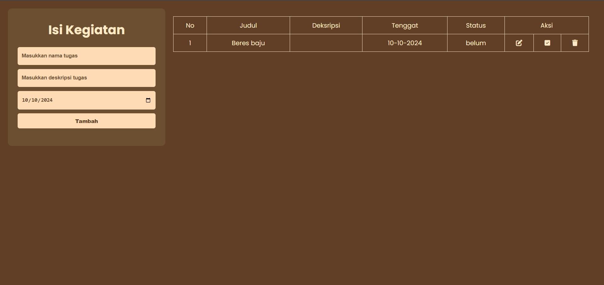

# APLIKASI SEDERHANA TO-DO LIST

Aplikasi To-Do List sederhana berbasis web yang memungkinkan pengguna untuk mengelola tugas-tugas mereka dengan mudah.

## FITUR 

- Tambah tugas baru dengan judul, deskripsi, dan tenggat waktu
- Lihat daftar tugas dalam bentuk tabel
- Edit tugas yang sudah ada
- Tandai tugas sebagai selesai atau belum selesai
- Hapus tugas

## TEKNOLOGI YANG DIGUNAKAN

- HTML
- CSS
- PHP
- SQLite
- FontAwesome

## CARA PENGGUNAAN

1. Untuk menambah tugas baru, isi kotak form di bagian atas halaman dan klik "Tambah".
1. Untuk mengedit tugas, klik ikon pensil di samping tugas yang ingin diedit.
1. Untuk menandai tugas sebagai selesai atau belum selesai, klik ikon ceklis di samping tugas.
1. Untuk menghapus tugas, klik ikon tempat sampah di samping tugas.

---

> **SEGALA KEKURANGAN MOHON DIBERITAHU*

